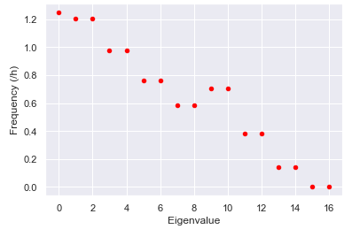
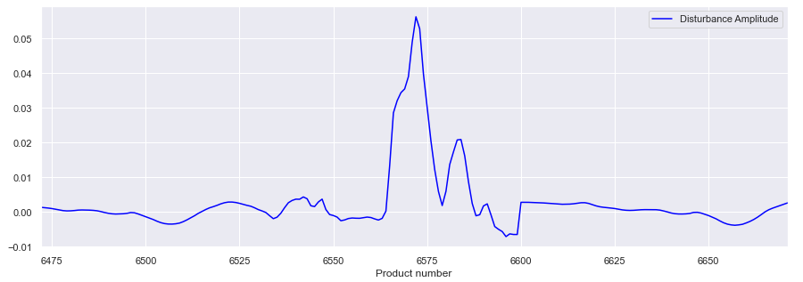
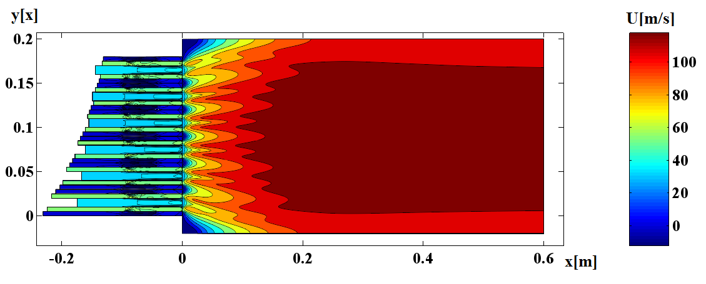
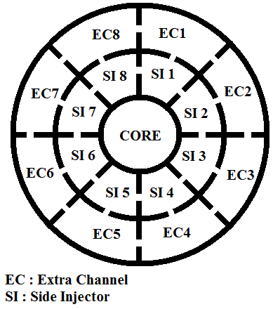
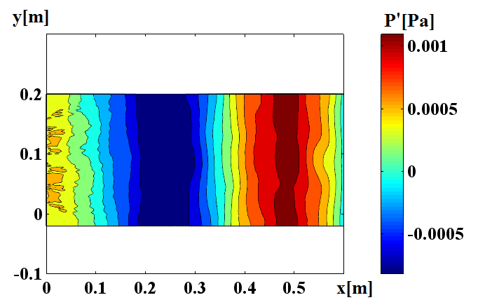
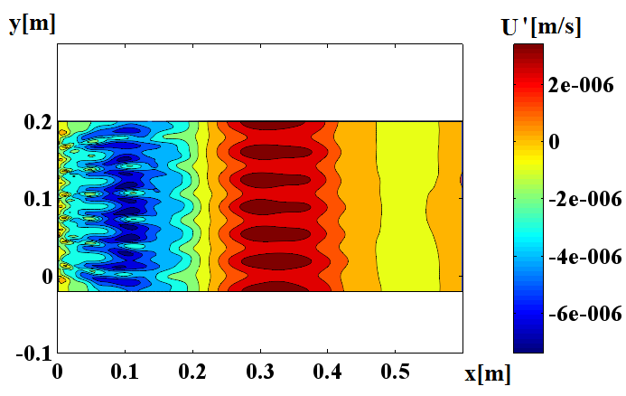
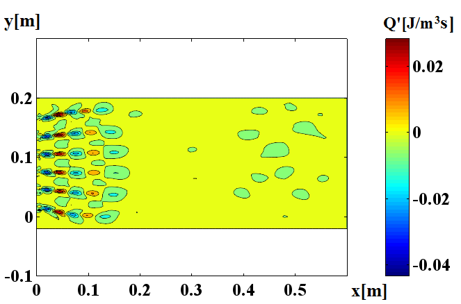

## Disruptive Marketing, Client behavior change propagation due to a discount

The study focuses on the influence of disruptive marketing on the customer behavior for a specific cluster of items, 
here electronic items, the disruption marketing is performed by introducing a discount ads for 24 minutes only on the webpage corresponding the closest item to center of this cluster of items.

The Dynamic mode decomposition (DMD) is used to track the disturbances and their frequencies in the number of visits on the webpages for items in the cluster. 
A DMD algorithm developed in previous studies is used here to enable this disturbance tracking. Here are frequencies of disturbances.

Here the disturbance with the largest amplitude.

More information regarding the developed DMD algorithm in the file called [PaperIV.pdf](PaperIV.pdf).
This paper was written for an international conference and it reprents a part of my work during Ph.D in ML for thermoacoustics.

Extra results can be observed displaying the capacity of the developed DMD algorithm for another case shown below. I have developed a complex injecting system to drastically reduce vibrations over a frequency range of 1000Hz in a coumbustion engine.
This unique design used injectors as vibration damping system. 

Here  is one injecting system composed of a core, side injectors and extra channels.

The developed DMD algorithm gaves access to disturbances (acoustic and hydrodynamic waves) in the combustion chamber that exist within highly non linear flow.
This flow field can be seen as a matrix of non linear data. Here the pressure, the velocity and the energy fluctuations are displayed.

